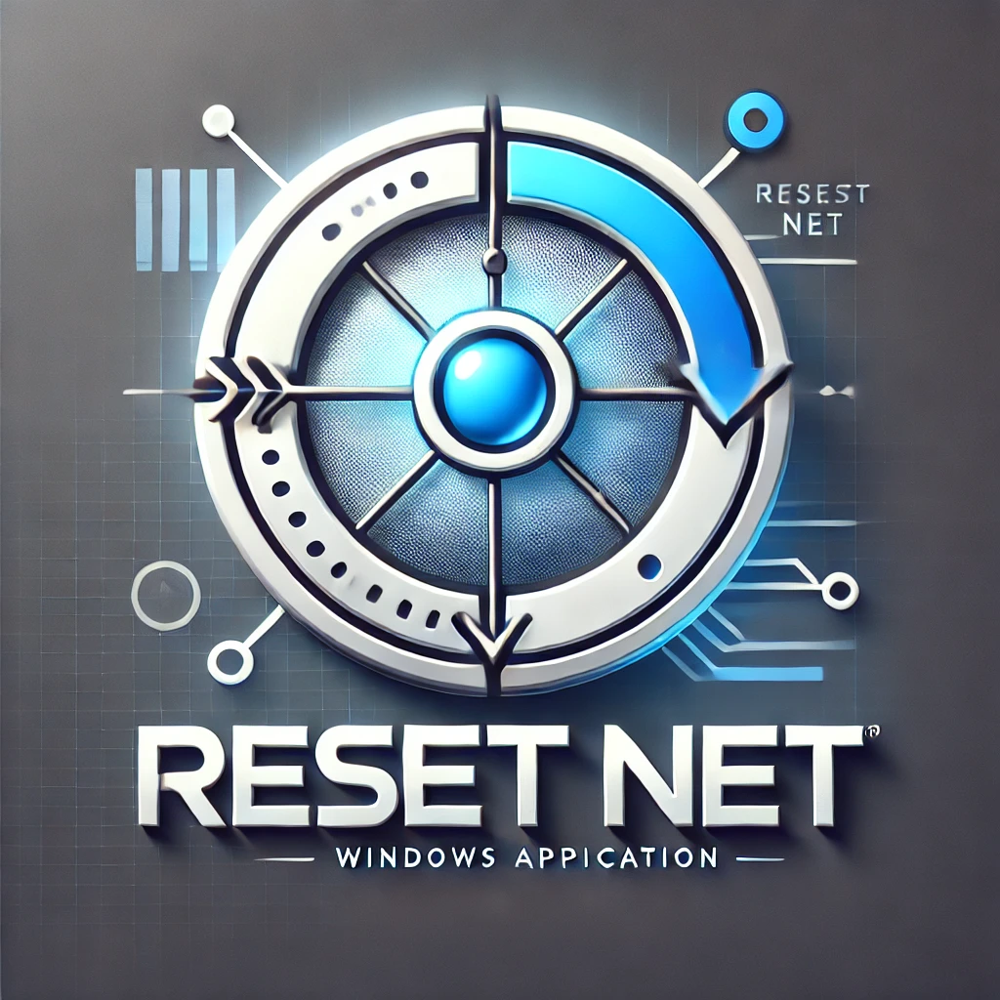

<!-- PROJECT LOGO -->
 

  <h1>Reset Net</h1>
  

<!-- ABOUT THE PROJECT -->

## About The Project

[![Contributors][contributors-shield]][contributors-url]
[![Forks][forks-shield]][forks-url]
[![Issues][issues-shield]][issues-url] 
Repo: 

Project: 

Reset_Net est un batch de manipulation des connexions réseaux

Reset Net est un utilitaire Windows simple mais puissant conçu pour résoudre rapidement les problèmes de connexion réseau courants. Cet outil automatise plusieurs commandes système essentielles en un seul clic, permettant de :

- Réinitialiser la pile TCP/IP
- Nettoyer le cache DNS
- Restaurer les paramètres Winsock
- Redémarrer les adaptateurs réseau
- Diagnostiquer les problèmes de connectivité
- Générer des rapports de diagnostic détaillés avec historique
- Exporter les configurations réseau complètes

Idéal pour les administrateurs système, les techniciens informatiques et tout utilisateur rencontrant des problèmes de connexion réseau.

(<a href="#readme-top">back to top</a>)

## Utilisation

1. **Téléchargement**
   - Téléchargez le fichier batch (.bat) depuis ce dépôt
   - Ou clonez le dépôt : `git clone https://github.com/Erik-42/reset_net.git`

2. **Exécution**
   - Double-cliquez sur le fichier .bat
   - Ou exécutez-le en tant qu'administrateur (recommandé)

3. **Fonctionnalités**
   - Réinitialise les paramètres TCP/IP
   - Vide le cache DNS
   - Réinitialise le Winsock
   - Redémarre les adaptateurs réseau
   - Génère un rapport de statut détaillé
   - Affiche les informations de diagnostic réseau
   - Vérifie la connectivité Internet
   - Exporte un rapport complet au format texte

⚠️ **Note importante** : 
- L'exécution en tant qu'administrateur est requise pour un fonctionnement optimal
- Une connexion Internet active n'est pas nécessaire pour l'utilisation basique
- Un redémarrage du système peut être nécessaire après l'utilisation

## Testez le projet

Github: [https://github.com/Erik-42/reset_net](https://github.com/Erik-42/reset_net)

(<a href="#readme-top">back to top</a>)

## License

Distributed under the GNU GENERAL PUBLIC LICENSE
Version 3. 
See `LICENSE.txt` for more information.

(<a href="#readme-top">back to top</a>)

## Contact

[![GitHub followers][github followers-shield]][github followers-url]
[![Stargazers][stars-shield]][stars-url]
[![GitHub repo][github repo-shield]][github repo-url]

[![Github Badge][github badge-shield]][github badge-url]
[![LinkedIn][linkedin-shield]][linkedin-url]

<a href = 'https://basillecorp.dev'>  basillecorp.dev</a>

mesen.erik@gmail.com

(<a href="#readme-top">back to top</a>)

<!-- MARKDOWN LINKS & IMAGES -->
<!-- https://www.markdownguide.org/basic-syntax/#reference-style-links -->

[wakatime-shield]: https://wakatime.com/badge/user/f84d00d8-fee3-4ca3-803d-3daa3c7053a5.svg
[wakatime-url]: https://wakatime.com/@f84d00d8-fee3-4ca3-803d-3daa3c7053a5
[github badge-shield]: https://img.shields.io/badge/Github-Erik--42-155?style=for-the-badge&logo=github
[github badge-url]: https://github.com/Erik-42
[github repo-shield]: https://img.shields.io/badge/Repositories-68-blue
[github repo-url]: https://github.com/Erik-42/Erik-42?tab=repositories
[github followers-shield]: https://img.shields.io/github/followers/Erik-42
[github followers-url]: https://github.com/followers/Erik-42
[contributors-shield]: https://img.shields.io/github/contributors/Erik-42/export-project-structure
[contributors-url]: https://github.com/Erik-42/export-project-structure/graphs/contributors
[forks-shield]: https://img.shields.io/github/forks/Erik-42/reset_net
[forks-url]: https://github.com/Erik-42/reset_net/forks
[issues-shield]: https://img.shields.io/github/issues-raw/Erik-42/reset_net
[issues-url]: https://github.com/Erik-42/reset_net/issues
[stars-shield]: https://img.shields.io/github/stars/Erik-42
[stars-url]: https://github.com/Erik-42?tab=stars
[linkedin-shield]: https://img.shields.io/badge/-LinkedIn-black.svg?style=for-the-badge&logo=linkedin&colorB=555
[linkedin-url]: https://www.linkedin.com/in/erik-mesen/

